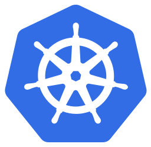
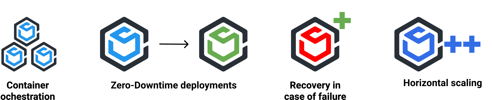
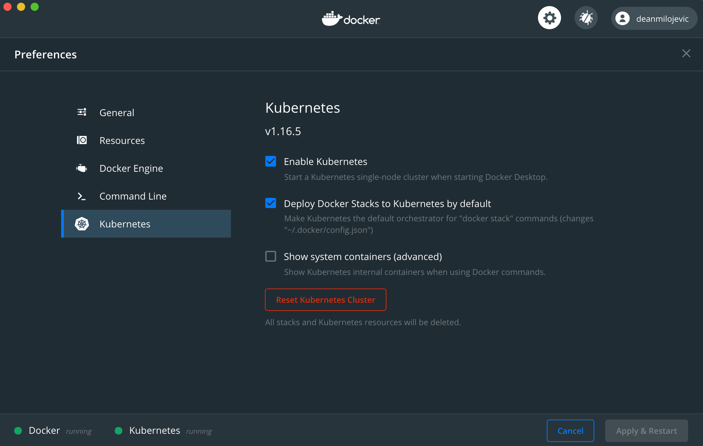
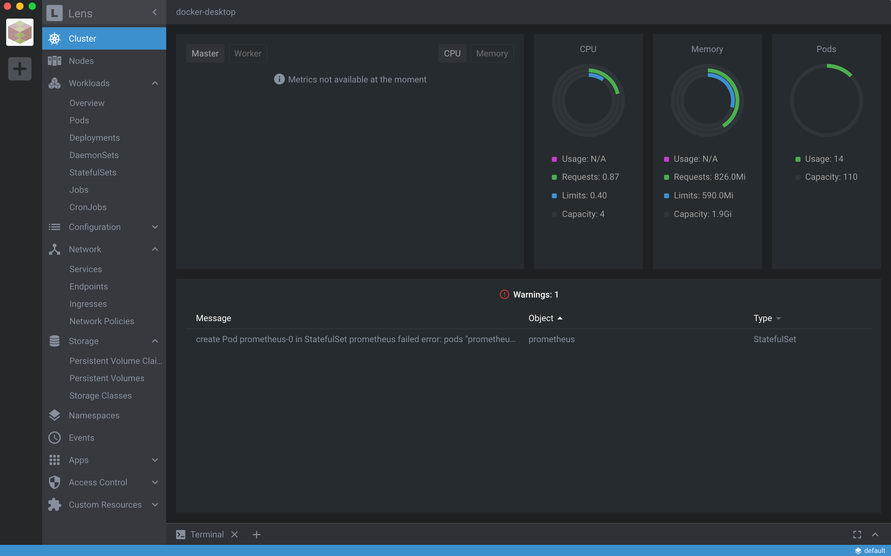
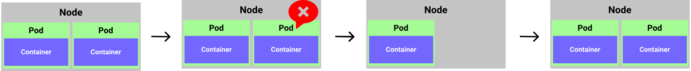
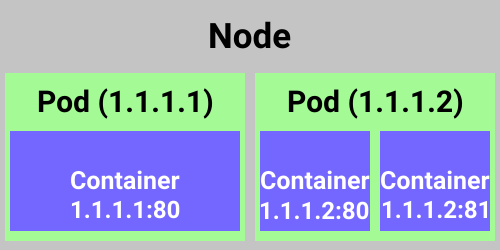
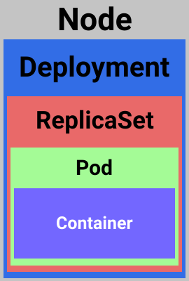

<p align=center>
  
</p>

# K8s for Developers

[Kubernetes](https://kubernetes.io/) is an open-source system for automating deployment, scaling, and management of containerized applications.

Some of the key features of k8s are:

1. Service discovery & load balancing
2. Automated rollouts/rollbacks
3. Storage orchestration
4. Self-healing in case of problems
5. Horizontal scaling
6. Secretes management
7. Configuration management

This is just some of the benefits system like k8s offers. From developer point of view, this are some of the most crucial ones, imo. From development point of view, there is some additional benefits that come with using `containers` and `k8s`. Yes, we could use the `docker` and `docker-compose` for most of the things that we are gonna mention. On the other hand, combining power of `docker` and benefits mentioned above from k8s, we are getting a really powerful tool in the arsenal.

Lets reflect on the benefits that we have using tools like `docker` and `containers` during development:

<p align=center>
  
</p>

With this out of the way, lets see some really useful benefits of the k8s for developers:

<p align=center>
  
</p>

Some of the reasons you would like to run k8s during development lifecycle:

1. Emulating environment setup (probably just partially) locally
2. E2E testing
3. Load testing
4. Troubleshooting

One of the personal examples on when it is useful to run the k8s locally was implementing a `CronJob` for a feature I was working on. When run with `docker-compose` the container was behaving without any issues, but when finally deployed to the test environment (that runs on k8s) it would almost it would end up in a `CrashLoopBackOff` on the start. After some time trying to figure out (logging was also not showing any useful information about failure), I started the k8s locally and deployed my `CronJob`. After just minutes into looking into the problem, it was obvious what was the problem. The `secrete` injector was having a problem with one of the secretes being used for the `CronJob`.

Another example is when you start playing around with optimizing your cluster and defining resources (CPU/RAM) for your `pods`. It can be useful to run the setup locally and put under a load test to see what are some baseline numbers you can configure for proper scaling (and how many replicas is a good start for your scenario).

## Desired state and k8s

The k8s provide a declarative way to define a cluster state.

<p align=center>
  
</p>

This is offered by k8s by offering internal services that handle this kind of state transitions. K8s have a concept of the `master node` and `worker nodes`. The `master node` (one or more) is responsible of management/orchestration of the `worker nodes`. This is what in k8s is known as a `cluster`.

The `pod` is just a k8s way of hosting a `container`. The `container` is the "place" where the application will be running. This are just terms that are used to describe the ecosystem and different "abstraction" layers of the deployment. The analogy to describe `pod` and `container` is the packaging of the product. The `pod` is the package and the `container` is the product you will be "using".

The `node` can be physical servers or virtual machines. Each node can have multiple `pods` running in it. That is where the horizontal scaling comes into the picture. The communication towards the application itself goes through the multiple layers. This is to ensure all the benefits of the k8s that were mentioned and that developer doesn't need to think about.

The `master node` keeps track of cluster through [etcd](https://etcd.io/). This is a distributed, reliable key-value store for the most critical data of a distributed system. The next part in this picture is the `controller manager`, that together with `scheduler` subsystem handles incoming requests. When the request comes to the cluster, `controller manager` schedules it (using `scheduler`) for processing. `Scheduler` will take care of the request based on the available resources, that is `pods`. This will be done based on the health, available resources, etc.

<p align=center>
  
</p>

The interaction between the developer and the cluster is done over the `API` endpoint. This is a RESTful service. When communicating with the `API` it is possible to send payload, to be executed on the `nodes`, in `JSON` or `YAML` format. Then they will be scheduled (using the same tools explained above) to run on the nodes in the `cluster`. The popular tool that comes with k8s, to leverage the `API`, is `kubectl`. This is a CLI tool, that is an client implementation of the `API` endpoints to allow the communication with the `cluster`.

<p align=center>
  
</p>

To allow the communication between the `worker node` and `master node` each node has an agent called `kubelet`. This agent is responsible to register `node` with `cluster`, that is `controller manager`. It also reports the status of the node, for the `master node` to know what to do in  case something goes wrong and so on. The `container runtime` is also a subsystem in that allows the running of the `containers` within the `pods`. The `kube-proxy` is the system that allows the networking and proper functioning of the node in the network. This means getting a unique IP address for each `pod` running within the `node`. This goes hand in hand with `services` that will be explained down the line.

<p align=center>
  
</p>

## Running k8s locally

There are different ways of running the k8s locally and to my knowledge most popular are:

1. [Docker Desktop](https://www.docker.com/products/docker-desktop)
2. [Minikube](https://github.com/kubernetes/minikube)

There are some other, but haven't tried them yet so not gonna touch them at this point. Currently, I am using `docker desktop` for all my development needs, including k8s. It is quite easy to enable the k8s locally:

<p align=center>
  
</p>

In case of the problems enabling this (process is quite similar for Windows), I suggest StackOverflow :)

To view something using a GUI, there is a Web UI that can be configured for k8s. For more information:
[https://kubernetes.io/docs/tasks/access-application-cluster/web-ui-dashboard/](https://kubernetes.io/docs/tasks/access-application-cluster/web-ui-dashboard/)

Personally, if I need this I prefer tools like Lens as they do offer the same functionality without a hustle of needing to install the Web UI on the cluster and running the proxy and playing with all that.



## Pods

`Pods` are the smallest deployable units of computing that can be created and managed in Kubernetes. In short, they are the fundamental layer of the k8s that we can manage/deploy. They are used to run one or more containers, that is they act as environment for the container to run in. Even if it is possible to have multiple `containers` per `pod`, this is not something that is encouraged. The recommended mantra for this "one process per container and one container per pod", or at least trying to make a "mantra" :)

Defining `replicas` when deploying the `pod` will indicate on how many instances/copies of the pod/container (this can be used interchangeably if we follow the mantra) we will be running within the `node`. This is the `horizontal scaling` that will be taken care automatically for you by k8s. K8s will then load balance the incoming traffic across available pods and allow high availability of the application. In case that one of the pods is "unhealthy", k8s will automatically remove it and replace it with a new instance. This means that `pods` never recover from failure, they are replaced with a new instance.

<p align=center>
  
</p>

The networking for pods works as following:

1. Each pod has a unique IP address that gets assigned to it. This is called `Cluster IP` address.
2. The `containers` within the `pod` *share* the same IP address (of the pod), but they **have** the different ports. No 2 `containers` can have the same `port` and be in the same `pod`. Also, `containers` can span multiple `pods`. In case you need to have 2 or more `containers` in the `pod` (on internet found it referred to as *sidecar*, but never experienced a need for this), then you must ensure the `ports` are different for **each** container. The communication in the container is done over the same loopback network interface (localhost), so that makes it simple.
3. Ports can be reused in separate `pod containers`. That means that if `container in pod A` has a port of `80` assigned, the `container in pod B` can also have the port `80` assigned.

<p align=center>
  
</p>

### Creating a pod

The simplest way to create a pod is using the following command:

```bash
kubectl run [pod-name] --image=[image-name]

# example
kubectl run my-nginx --image=nginx:alpine
```

This is something that will be deprecated in the future (you can see by the output of the command):

```bash
kubectl run --generator=deployment/apps.v1 is DEPRECATED and will be removed in a future version. Use kubectl run --generator=run-pod/v1 or kubectl create instead. deployment.apps/my-nginx created
```

Now when we execute the command:

```bash
kubectl get all
```

the result should look like following (on clean cluster):

```bash
NAME                            READY   STATUS    RESTARTS   AGE
pod/my-nginx-576bb7cb54-p45zj   1/1     Running   0          96s

NAME                 TYPE        CLUSTER-IP   EXTERNAL-IP   PORT(S)   AGE
service/kubernetes   ClusterIP   10.96.0.1    <none>        443/TCP   16h

NAME                       READY   UP-TO-DATE   AVAILABLE   AGE
deployment.apps/my-nginx   1/1     1            1           96s

NAME                                  DESIRED   CURRENT   READY   AGE
replicaset.apps/my-nginx-576bb7cb54   1         1         1       96s
```

Except `ClusterIP`, everything was created with the command we just run. Tho it is much more then expected as we see couple more extra resources associated with the `pod`. This topics will be discussed in the [Deployments](#deployments) section of this document. Tho the pod is now running, we can't get to it, so lets see how we can manage this in the following chapter.

### Port forwarding

When the `pod` starts, it gets an `Cluster IP` address. This is something that is internal for the `cluster` itself. In other words, we can't access it directly as the `containers` and `pods` are only accessible within the cluster. To make this happen, we need to do a *port forwarding*. This is similar to the `docker` and `docker-compose`. The command for *port forwarding*:

```bash
kubectl port-forward [pod-name] [external-port]:[internal-port]

# example

kubectl port-forward my-nginx-576bb7cb54-p45zj 8080:80
```

After running the command above (with your `pod` name), you should see the following:

```bash
Forwarding from 127.0.0.1:8080 -> 80
Forwarding from [::1]:8080 -> 80
```

Now lets try curl our endpoint and see what will the output be:

```bash
http GET localhost:8080
# I am using a CLI tool httpie (https://httpie.org/) that is a bit nicer, imo, when working with the examples
```

with the output of:

```html
HTTP/1.1 200 OK
Accept-Ranges: bytes
Connection: keep-alive
Content-Length: 612
Content-Type: text/html
Date: Mon, 25 May 2020 07:07:32 GMT
ETag: "5e95ccbe-264"
Last-Modified: Tue, 14 Apr 2020 14:46:22 GMT
Server: nginx/1.17.10

<!DOCTYPE html>
<html>
<head>
<title>Welcome to nginx!</title>
<style>
    body {
        width: 35em;
        margin: 0 auto;
        font-family: Tahoma, Verdana, Arial, sans-serif;
    }
</style>
</head>
<body>
<h1>Welcome to nginx!</h1>
<p>If you see this page, the nginx web server is successfully installed and
working. Further configuration is required.</p>

<p>For online documentation and support please refer to
<a href="http://nginx.org/">nginx.org</a>.<br/>
Commercial support is available at
<a href="http://nginx.com/">nginx.com</a>.</p>

<p><em>Thank you for using nginx.</em></p>
</body>
</html>
```

Back in the terminal where we started *port forward* we should also see some information:

```bash
kubectl port-forward my-nginx-576bb7cb54-p45zj 8080:80
Forwarding from 127.0.0.1:8080 -> 80
Forwarding from [::1]:8080 -> 80
Handling connection for 8080
```

### Imperative vs. Declarative

Ok, now that we covered how we can create a pod in *imperative* way, lets move towards what is considered a standard. That is, using *declarative* way of creating resources. This is done using `YAML`. There are tone of the information on this topic online, so not gonna cover it here. For this to work with k8s, there are certain rules (or to be exact a `schema` to be followed). So let us try create the same thing using `YAML` now.

```yml
apiVersion: v1
kind: Pod
metadata:
  name: my-nginx
  labels:
    name: my-nginx
spec:
  containers:
  - name: my-nginx
    image: nginx:alpine
    resources:
      limits:
        memory: "128Mi"
        cpu: "500m"
    ports:
      - containerPort: 8080

```

There ar some key-value pairs in here that we can ignore for now (this is just a default template I have configured locally). Now there are 2 commands we can use to create the `pod` using `YAML`:

```bash
kubectl create -f [file-name.yaml|file-name.yml]
# or
kubectl apply -f [file-name.yaml|file-name.yml]
```

The difference is what will happen in case of that `pod` already exists on the cluster. The `create` command ends up in error while `apply` will do create or update of the `pod`. For most cases, I prefer the `apply` command.

```bash
kubectl apply -f src/nginx.pod.yaml
# file src/nginx.pod.yml can be found in the root of this repository
```

This should give an output like the following:

```bash
pod/my-nginx created
```

As you can see, the output is a bit different then originally, but also now when we run the command `kubectl get all` the number of resources created will be different as well:

```bash
NAME           READY   STATUS    RESTARTS   AGE
pod/my-nginx   1/1     Running   0          5m7s

NAME                 TYPE        CLUSTER-IP   EXTERNAL-IP   PORT(S)   AGE
service/kubernetes   ClusterIP   10.96.0.1    <none>        443/TCP   17h
```

To check if everything works as before, lets run `kubectl port-forward my-nginx 8080:80` and the `http GET localhost:8080`. The output should be exactly the same as in the previous scenario when we used the imperative way. Awesome.

Now, next thing that is really useful to check (when troubleshooting or just to see what was created) is to `describe` the resource. This means that you can get all the information associated with the resource using the following command:

```bash
kubectl describe pod my-nginx
#the output is as follows
Name:         my-nginx
Namespace:    default
Priority:     0
Node:         docker-desktop/192.168.65.3
Start Time:   Mon, 25 May 2020 09:57:46 +0200
Labels:       name=my-nginx
Annotations:  kubectl.kubernetes.io/last-applied-configuration:
                {"apiVersion":"v1","kind":"Pod","metadata":{"annotations":{},"labels":{"name":"my-nginx"},"name":"my-nginx","namespace":"default"},"spec":...
Status:       Running
IP:           10.1.0.37
IPs:
  IP:  10.1.0.37
Containers:
  my-nginx:
    Container ID:   docker://8ca36a7c77cf4b65dd03a487cd2b572c320ccbc62aebc2ba7da4a96023f6b665
    Image:          nginx:alpine
    Image ID:       docker-pullable://nginx@sha256:763e7f0188e378fef0c761854552c70bbd817555dc4de029681a2e972e25e30e
    Port:           80/TCP
    Host Port:      0/TCP
    State:          Running
      Started:      Mon, 25 May 2020 09:57:47 +0200
    Ready:          True
    Restart Count:  0
    Limits:
      cpu:     500m
      memory:  128Mi
    Requests:
      cpu:        500m
      memory:     128Mi
    Environment:  <none>
    Mounts:
      /var/run/secrets/kubernetes.io/serviceaccount from default-token-kxzww (ro)
Conditions:
  Type              Status
  Initialized       True
  Ready             True
  ContainersReady   True
  PodScheduled      True
Volumes:
  default-token-kxzww:
    Type:        Secret (a volume populated by a Secret)
    SecretName:  default-token-kxzww
    Optional:    false
QoS Class:       Guaranteed
Node-Selectors:  <none>
Tolerations:     node.kubernetes.io/not-ready:NoExecute for 300s
                 node.kubernetes.io/unreachable:NoExecute for 300s
Events:
  Type    Reason     Age        From                     Message
  ----    ------     ----       ----                     -------
  Normal  Scheduled  <unknown>  default-scheduler        Successfully assigned default/my-nginx to docker-desktop
  Normal  Pulled     20m        kubelet, docker-desktop  Container image "nginx:alpine" already present on machine
  Normal  Created    20m        kubelet, docker-desktop  Created container my-nginx
  Normal  Started    20m        kubelet, docker-desktop  Started container my-nginx
  ```

There is a lot of information here. Also we can see all the information for our pod that we provided (for example, labels, resources, etc.). This is really detailed and good to know when you want to check a particular resource in case of some problems. The `Events` section in this output can usually indicate some high level problems and be a good starting point in troubleshooting the issue.

### Pod health

Now let us touch on the subject that can help k8s to help you when something goes wrong. That is using the `probs` to determine the state/health of the `pod container`. There are 2 types of the `probes` k8s are using to determine what is happening (or what it should to with a particular `container`):

1. Liveness prob
2. Readiness prob

There is a subtle difference between the two. Liveness prob says is `pod` alive. Readiness prob checks is the requests can be forwarded to the `pod`. `Probs` are something that will k8s run behind a scene for you, sort of diagnostic, periodically. So it is not something that we need to worry about, except when it starts failing :)

So in case that `container` fails on the check, there is a policy associated with the `probs` on what should happen next. By default this policy is set to **restart** always (`restartPolicy: Always`). This can be changed, depending on the use-case and expectations on what should happen in case of the failure.

There are different types of checks we can perform in combination when defining the `probs`:

1. ExecAction: Run some action inside of the `container` (file check, etc.)
2. TCPSocketAction: TCP check on the port inside of the `container`
3. HTTPGetAction: Run the HTTP GET request on the endpoint defined within the `container`

The "result" of the check can be:

1. Success
2. Failure
3. Unknown

Now, the following example shows how to define the `liveness and readiness prob` in declarative way (again, this only means using `YAML`):

```yml
livenessProbe:
  httpGet:
    path: /index.html
    port: 80
  initialDelaySeconds: 10
  timeoutSeconds: 2
  periodSeconds: 10
  failureThreshold: 1
readinessProbe:
  httpGet:
    path: /index.html
    port: 80
  initialDelaySeconds: 10
  timeoutSeconds: 2
  periodSeconds: 10
  failureThreshold: 0
```

Honestly, depending on the situation it us up to us to define this checks properly. I know that most common answer on 99,999% of questions in developer world ends in that answer "it depends". So a simple rule of thumb for me, as the description of `probs` defines them, is:

1. Liveness probe:  a simple check if the application is running (process check, an endpoint that returns Success/Failure) and nothing more.
2. Readiness probe: a check of dependencies (if you know that you can't serve the request because your db is down) and can you guarantee a success when processing the request.

The entire example can be found in the `src/nginx.health.pod.yaml`. To test this you can `exec` into the `container` and try renaming the file. When you describe the `pod` you should see something like this:

```bash
  Normal   Scheduled  <unknown>          default-scheduler        Successfully assigned default/my-nginx-health to docker-desktop
  Warning  Unhealthy  20s                kubelet, docker-desktop  Liveness probe failed: HTTP probe failed with statuscode: 404
  Normal   Killing    20s                kubelet, docker-desktop  Container my-nginx-health failed liveness probe, will be restarted
```

Now when you go and fetch `pods` and `exec` into it, you should see that `index.html` for example is now back (even after you removed it or renamed it). This is because the `pod` was removed and the new instance was started. That new instance has no relation with that file change we did, so it only has a fresh new state.

### Deletion of pod

Deletion of `pod` has an interesting side-effect that can be confusing first time. WHen you delete the `pod` using the command bellow:

```bash
kubectl delete pod [pod-name]

# example

kubectl delete pod my-nginx
```

Afterwards, you can try to get the all `pods` within the cluster:

```bash
kubectl get pods
```

you will again see your `pod`. If you look carefully and compare before/after situation, you will notice that there is a difference. `Pod` has a new **id**. This is expected behavior of the k8s, as it tries to keep the desired state. The `master node` got notified of deletion of the `pod`, checked the `deployment` (discussed in upcoming chapter) and saw that `pod` should have `number of replicas` running and the started a new instance. So the `pod` was deleted, it is just that new instance of it was started automatically.

To fully remove the you need to remove the `deployment` that is associated with this `pod` (or that manages the `pod`). For this you can check the [Deleting the deployment](###deleting-the-deployment).

In case that pod was created using the *declarative* way (that is, using `YAML`) like in example above, we can actually just delete the `pod` and it will be gone. This is because the only thing we created was `pod`, the command will not create any associated resource (`deployment` that is) that will try to put the desired state back (in case of deletion).

Also really nice way to cleanup/delete resources created using file is their deletion using the file:

```bash
kubectl delete -f src/nginx.pod.yaml
```

### Getting inside of the pod

There is an useful command that allows you to connect to the `pod/container` and do some troubleshooting on the file system for example (check if all files were being deployed and so on). That is using the command:

```bash
kubectl exec [pod-name] -it sh

# example
kubectl exec my-nginx -it sh
```

This will give you access to the file system inside of the `container` so you can check what is happening inside.

```bash
# example of command above
/ # ls
bin    dev    etc    home   lib    media  mnt    opt    proc   root   run    sbin   srv    sys    tmp    usr    var
/ #
```

## Deployments

Now that we are familiar with `pods`, let us move towards more real-world scenario. The `pods` and `containers` are places where we gonna spend most of the time, tho the scenario with till now was not something we see in the wild. Mostly as we loose the benefits of having k8s in place (if we delete the `pod` and there is nothing managing, like `deployment`, then it is gone). The `deployments` are the managing part and they will ensure that `pod` stays up and running. It will manage the desired state, what happens in case of failures and so on.

`Deployment` is a declarative way to managed the `pods` using something called `ReplicaSet`. In short, they are wrapping the `ReplicaSet` and provide an easier way to manage the `pods`. This two pieces ensure that `pods` stay and running based on the **desired state**. This is something that we don't need to think about, it will be taken behind a scenes for us by the k8s. We declaratively describe what we want (how many pods, what happens in case of failure, etc.) and `deployment`, together with `ReplicaSet`, will try to keep that state.

<p align=center>
  
</p>

`Deployments` manage the following:

1. Manages the `pods` using the `ReplicaSet`
2. Ensure the zero-downtime by creating/destroying `ReplicaSets`
3. Scaling of the `ReplicaSet` which causes scaling of the `pods`
4. Provides rollbacks, so you can easily go back to the previous state in case of some issues with a new version of your app

### ReplicaSet

`ReplicaSet` is a declarative way to manage the `pods`. It is responsible to monitor the `pods` that are running and in case of failure to remove/create a new instance of the failing `pod`. Some of the things that `ReplicaSet` is taking care in the background:

1. Self recovery in case of failure
2. Ensures the desired number of `pods`
3. Scaling the number of `pods`
4. Fault tolerance

### Declarative way of defining Deployment and ReplicaSet

```yml
apiVersion: apps/v1
kind: Deployment
metadata:
  name: my-nginx
  labels:
    app: my-nginx
spec:
  replicas: 1
  selector:
    matchLabels:
      app: my-nginx
  template:
    metadata:
      labels:
        app: my-nginx
    spec:
      containers:
      - name: my-nginx
        image: nginx:alpine
        livenessProbe:
          httpGet:
            path: /index.html
            port: 80
          initialDelaySeconds: 10
          timeoutSeconds: 2
          periodSeconds: 10
          failureThreshold: 1
        readinessProbe:
          httpGet:
            path: /index.html
            port: 80
          initialDelaySeconds: 10
          timeoutSeconds: 2
          periodSeconds: 10
          failureThreshold: 0
        resources:
          limits:
            memory: "128Mi"
            cpu: "500m"
        ports:
        - containerPort: 80
```

The rest is quite similar.

```bash
kubectl apply -f src/nginx.deployment.yaml
```

Tho this time when we run the command `kubectl get all` we will get a bit more (like what we had with `kubectl run ...` command):

```bash
NAME                            READY   STATUS    RESTARTS   AGE
pod/my-nginx-5d98b969bc-m6d7k   0/1     Running   0          7s

NAME                 TYPE        CLUSTER-IP   EXTERNAL-IP   PORT(S)   AGE
service/kubernetes   ClusterIP   10.96.0.1    <none>        443/TCP   21h

NAME                       READY   UP-TO-DATE   AVAILABLE   AGE
deployment.apps/my-nginx   0/1     1            0           7s

NAME                                  DESIRED   CURRENT   READY   AGE
replicaset.apps/my-nginx-5d98b969bc   1         1         0       7s
```

To make use of the defined labels (and get all the resources associated with some label, like for example `app: my-nginx`) we can run the command like this:

```bash
kubectl get all -lapp=my-nginx

# output
NAME                            READY   STATUS    RESTARTS   AGE
pod/my-nginx-5d98b969bc-m6d7k   1/1     Running   0          13m

NAME                       READY   UP-TO-DATE   AVAILABLE   AGE
deployment.apps/my-nginx   1/1     1            1           13m

NAME                                  DESIRED   CURRENT   READY   AGE
replicaset.apps/my-nginx-5d98b969bc   1         1         1       13m
```

This is has more use when you're having a large number of applications and its dependencies running within the cluster. This way you can just get things that you're interested in.

### Scaling

To scale the number of `pods`, we can run the following command:

```bash
kubectl scale deployment [deployment-name] --replicas=[number-of-pods]

# example
kubectl scale deployment my-nginx --replicas=2
```

This will result with following information when we get the `pods`:

```bash
kubectl get pods

# output
NAME                        READY   STATUS    RESTARTS   AGE
my-nginx-5d98b969bc-l9z6p   0/1     Running   0          3s
my-nginx-5d98b969bc-m6d7k   1/1     Running   0          18m
```

### Resource limits

It is also important to define the resource limits for the `pods`. Just to ensure that in case of one of the behaving out of expectations it doesn't bring down everything else with it. I already in most cases had this defined in the `YAML` files we saw until know, so nothing new there.

```yml
resources:
  limits:
    memory: "128Mi"
    cpu: "500m"
```

For more information about `units` used here:
[https://kubernetes.io/docs/concepts/configuration/manage-resources-containers/#resource-units-in-kubernetes](https://kubernetes.io/docs/concepts/configuration/manage-resources-containers/#resource-units-in-kubernetes)

### Deployment options

What k8s offer out of the box are several ways of doing deployments:

1. Rolling updates (default)
2. Rollback
3. Blue-green (or A/B) deployment
4. Canary deployment

For more information on this subject:
[https://kubernetes.io/docs/concepts/workloads/controllers/deployment/](https://kubernetes.io/docs/concepts/workloads/controllers/deployment/)

The default one, `rolling updates`, is extremely powerful feature. Mostly as it allows the **zero-downtime** when rolling out a new version of the software. To achieve this, the k8s will do the following:

1. New version of the app is created in its own `pod`
2. The old `pods` are still there, the new one is just added next to them
3. Then it starts shutting the old `pods` one by one and replacing them with newer versions

Quite simple and elegant solution that just works. I still remember pains when you needed to achieve the same results on other projects. With k8s it is the *default* way of doing deployments.

### Deleting the deployment

```bash
kubectl delete deployment [deployment-name]

# example
kubectl delete deployment my-nginx
```

For this command, you should see something like this:

```bash
 deployment.apps "my-nginx" deleted
 ```

 Now when we try to run the following command `kubectl get all`, there should not be any resources associated with the deployment:

```bash
NAME                 TYPE        CLUSTER-IP   EXTERNAL-IP   PORT(S)   AGE
service/kubernetes   ClusterIP   10.96.0.1    <none>        443/TCP   16h
```

## Services

## Storage

## ConfigMaps

## Secretes

## CronJobs

## Tools

[Lens](https://k8slens.dev/)