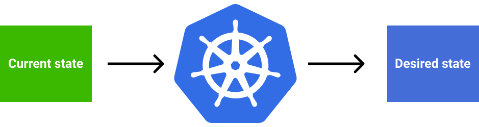
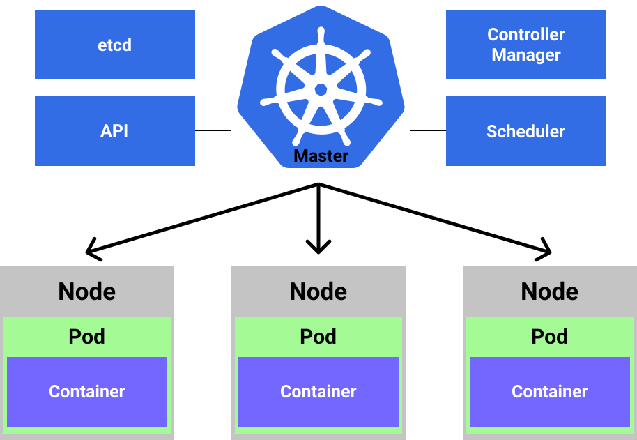
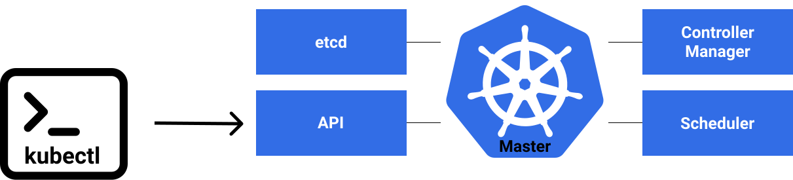
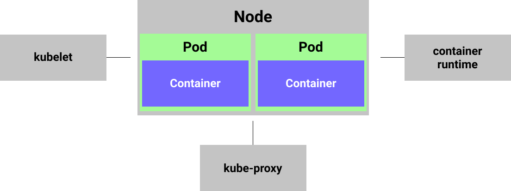

  

# K8s for Developers

[Kubernetes](https://kubernetes.io/) is an open-source system for automating deployment, scaling, and management of containerized applications.

Some of the key features of k8s are:

1. Service discovery & load balancing
2. Automated rollouts/rollbacks
3. Storage orchestration
4. Self-healing in case of problems
5. Horizontal scaling
6. Secretes management
7. Configuration management

This is just some of the benefits system like k8s offers. From developer point of view, this are some of the most crucial ones, imo.

## Desired state and k8s

The k8s provide a declarative way to define a cluster state.

  

This is offered by k8s by offering internal services that handle this kind of state transitions. K8s have a concept of the `master node` and `worker nodes`. The `master node` (one or more) is responsible of management/orchestration of the `worker nodes`. This is what in k8s is known as a `cluster`.

The `pod` is just a k8s way of hosting a `container`. The `container` is the "place" where the application will be running. This are just terms that are used to describe the ecosystem and different "abstraction" layers of the deployment. The analogy to describe `pod` and `container` is the packaging of the product. The `pod` is the package and the `container` is the product you will be "using".

The `node` can be physical servers or virtual machines. Each node can have multiple `pods` running in it. That is where the horizontal scaling comes into the picture. The communication towards the application itself goes through the multiple layers. This is to ensure all the benefits of the k8s that were mentioned and that developer doesn't need to think about.

The `master node` keeps track of cluster through [etcd](https://etcd.io/). This is a distributed, reliable key-value store for the most critical data of a distributed system. The next part in this picture is the `controller manager`, that together with `scheduler` subsystem handles incoming requests. When the request comes to the cluster, `controller manager` schedules it (using `scheduler`) for processing. `Scheduler` will take care of the request based on the available resources, that is `pods`. This will be done based on the health, available resources, etc.

  

The interaction between the developer and the cluster is done over the `API` endpoint. This is a RESTful service. When communicating with the `API` it is possible to send payload, to be executed on the `nodes`, in `JSON` or `YAML` format. Then they will be scheduled (using the same tools explained above) to run on the nodes in the `cluster`. The popular tool that comes with k8s, to leverage the `API`, is `kubectl`. This is a CLI tool, that is an client implementation of the `API` endpoints to allow the communication with the `cluster`.

  

To allow the communication between the `worker node` and `master node` each node has an agent called `kubelet`. This agent is responsible to register `node` with `cluster`, that is `controller manager`. It also reports the status of the node, for the `master node` to know what to do in  case something goes wrong and so on. The `container runtime` is also a subsystem in that allows the running of the `containers` within the `pods`. The `kube-proxy` is the system that allows the networking and proper functioning of the node in the network. This means getting a unique IP address for each `pod` running within the `node`. This goes hand in hand with `services` that will be explained down the line.

  

## Deployments

## Services
