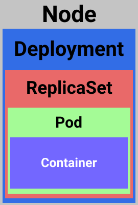

# Deployments

Now that we are familiar with `pods`, let us move towards more real-world scenario. The `pods` and `containers` are places where we gonna spend most of the time, tho the scenario with till now was not something we see in the wild. Mostly as we loose the benefits of having k8s in place (if we delete the `pod` and there is nothing managing, like `deployment`, then it is gone). The `deployments` are the managing part and they will ensure that `pod` stays up and running. It will manage the desired state, what happens in case of failures and so on.

`Deployment` is a declarative way to managed the `pods` using something called `ReplicaSet`. In short, they are wrapping the `ReplicaSet` and provide an easier way to manage the `pods`. This two pieces ensure that `pods` stay and running based on the **desired state**. This is something that we don't need to think about, it will be taken behind a scenes for us by the k8s. We declaratively describe what we want (how many pods, what happens in case of failure, etc.) and `deployment`, together with `ReplicaSet`, will try to keep that state.

<p align=center>
  
</p>

`Deployments` manage the following:

1. Manages the `pods` using the `ReplicaSet`
2. Ensure the zero-downtime by creating/destroying `ReplicaSets`
3. Scaling of the `ReplicaSet` which causes scaling of the `pods`
4. Provides rollbacks, so you can easily go back to the previous state in case of some issues with a new version of your app

## ReplicaSet

`ReplicaSet` is a declarative way to manage the `pods`. It is responsible to monitor the `pods` that are running and in case of failure to remove/create a new instance of the failing `pod`. Some of the things that `ReplicaSet` is taking care in the background:

1. Self recovery in case of failure
2. Ensures the desired number of `pods`
3. Scaling the number of `pods`
4. Fault tolerance

## Declarative way of defining Deployment and ReplicaSet

```yml
apiVersion: apps/v1
kind: Deployment
metadata:
  name: my-nginx
  labels:
    app: my-nginx
spec:
  replicas: 1
  selector:
    matchLabels:
      app: my-nginx
  template:
    metadata:
      labels:
        app: my-nginx
    spec:
      containers:
      - name: my-nginx
        image: nginx:alpine
        livenessProbe:
          httpGet:
            path: /index.html
            port: 80
          initialDelaySeconds: 10
          timeoutSeconds: 2
          periodSeconds: 10
          failureThreshold: 1
        readinessProbe:
          httpGet:
            path: /index.html
            port: 80
          initialDelaySeconds: 10
          timeoutSeconds: 2
          periodSeconds: 10
          failureThreshold: 0
        resources:
          limits:
            memory: "128Mi"
            cpu: "500m"
        ports:
        - containerPort: 80
```

The rest is quite similar.

```bash
kubectl apply -f src/nginx.deployment.yaml
```

Tho this time when we run the command `kubectl get all` we will get a bit more (like what we had with `kubectl run ...` command):

```bash
NAME                            READY   STATUS    RESTARTS   AGE
pod/my-nginx-5d98b969bc-m6d7k   0/1     Running   0          7s

NAME                 TYPE        CLUSTER-IP   EXTERNAL-IP   PORT(S)   AGE
service/kubernetes   ClusterIP   10.96.0.1    <none>        443/TCP   21h

NAME                       READY   UP-TO-DATE   AVAILABLE   AGE
deployment.apps/my-nginx   0/1     1            0           7s

NAME                                  DESIRED   CURRENT   READY   AGE
replicaset.apps/my-nginx-5d98b969bc   1         1         0       7s
```

To make use of the defined labels (and get all the resources associated with some label, like for example `app: my-nginx`) we can run the command like this:

```bash
kubectl get all -lapp=my-nginx

# output
NAME                            READY   STATUS    RESTARTS   AGE
pod/my-nginx-5d98b969bc-m6d7k   1/1     Running   0          13m

NAME                       READY   UP-TO-DATE   AVAILABLE   AGE
deployment.apps/my-nginx   1/1     1            1           13m

NAME                                  DESIRED   CURRENT   READY   AGE
replicaset.apps/my-nginx-5d98b969bc   1         1         1       13m
```

This is has more use when you're having a large number of applications and its dependencies running within the cluster. This way you can just get things that you're interested in.

## Scaling

To scale the number of `pods`, we can run the following command:

```bash
kubectl scale deployment [deployment-name] --replicas=[number-of-pods]

# example
kubectl scale deployment my-nginx --replicas=2
```

This will result with following information when we get the `pods`:

```bash
kubectl get pods

# output
NAME                        READY   STATUS    RESTARTS   AGE
my-nginx-5d98b969bc-l9z6p   0/1     Running   0          3s
my-nginx-5d98b969bc-m6d7k   1/1     Running   0          18m
```

## Resource limits

It is also important to define the resource limits for the `pods`. Just to ensure that in case of one of the behaving out of expectations it doesn't bring down everything else with it. I already in most cases had this defined in the `YAML` files we saw until know, so nothing new there.

```yml
resources:
  limits:
    memory: "128Mi"
    cpu: "500m"
```

For more information about `units` used here:
[https://kubernetes.io/docs/concepts/configuration/manage-resources-containers/#resource-units-in-kubernetes](https://kubernetes.io/docs/concepts/configuration/manage-resources-containers/#resource-units-in-kubernetes)

## Deployment options

What k8s offer out of the box are several ways of doing deployments:

1. **Rolling updates (default)**
2. **Rollback**
3. **Blue-green (or A/B) deployment**
4. **Canary deployment**

For more information on this subject:
[https://kubernetes.io/docs/concepts/workloads/controllers/deployment/](https://kubernetes.io/docs/concepts/workloads/controllers/deployment/)

The default one, `rolling updates`, is extremely powerful feature. Mostly as it allows the **zero-downtime** when rolling out a new version of the software. To achieve this, the k8s will do the following:

1. New version of the app is created in its own `pod`
2. The old `pods` are still there, the new one is just added next to them
3. Then it starts shutting the old `pods` one by one and replacing them with newer versions

Quite simple and elegant solution that just works. I still remember pains when you needed to achieve the same results on other projects. With k8s it is the *default* way of doing deployments.

## Deleting the deployment

```bash
kubectl delete deployment [deployment-name]

# example
kubectl delete deployment my-nginx
```

For this command, you should see something like this:

```bash
 deployment.apps "my-nginx" deleted
 ```

 Now when we try to run the following command `kubectl get all`, there should not be any resources associated with the deployment:

```bash
NAME                 TYPE        CLUSTER-IP   EXTERNAL-IP   PORT(S)   AGE
service/kubernetes   ClusterIP   10.96.0.1    <none>        443/TCP   16h
```
