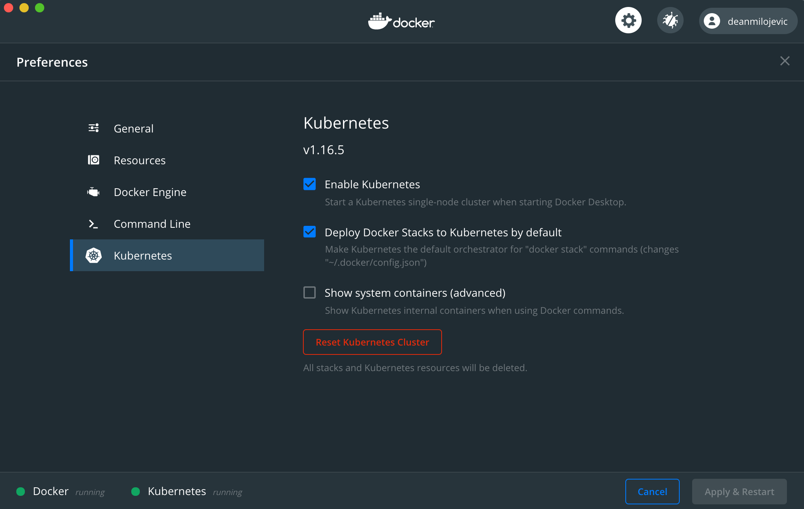

# Running k8s locally

There are different ways of running the k8s locally and to my knowledge most popular are:

1. [Docker Desktop](https://www.docker.com/products/docker-desktop)
2. [Minikube](https://github.com/kubernetes/minikube)

There are some other, but haven't tried them yet so not gonna touch them at this point. Currently, I am using `docker desktop` for all my development needs, including k8s. It is quite easy to enable the k8s locally:

  

In case of the problems enabling this (process is quite similar for Windows), I suggest StackOverflow :)

To view something using a GUI, there is a Web UI that can be configured for k8s. For more information:
[https://kubernetes.io/docs/tasks/access-application-cluster/web-ui-dashboard/](https://kubernetes.io/docs/tasks/access-application-cluster/web-ui-dashboard/)

Personally, if I need this I prefer tools like Lens as they do offer the same functionality without a hustle of needing to install the Web UI on the cluster and running the proxy and playing with all that.

