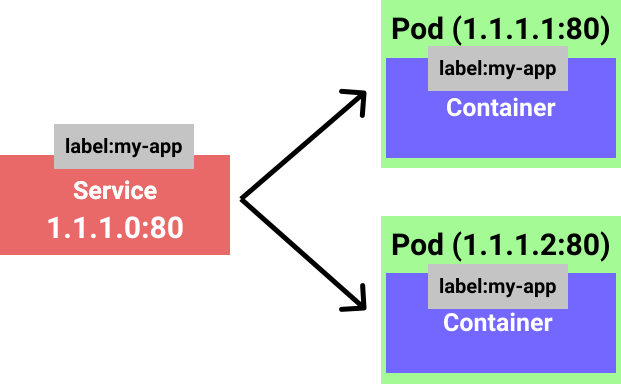
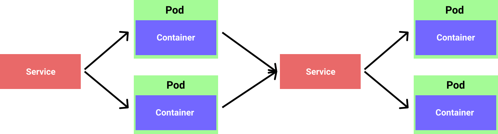
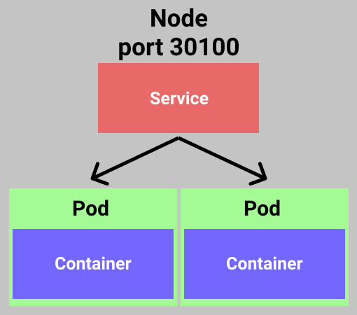
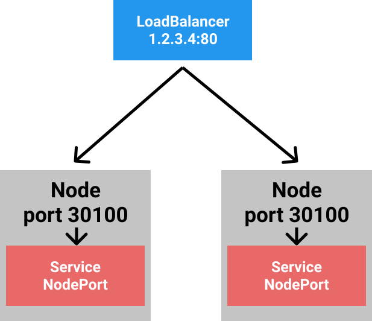
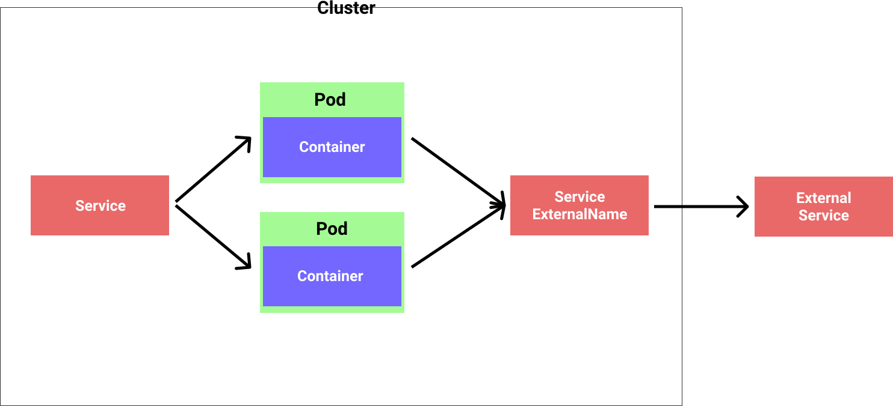

# Services

A `service` is an entry point to access one or more `pods`. Now on the point of why are they needed. `Pods` have "expiration" date so to say, we can't assume that they won't restart at any point or something goes wrong with them so they need to be restarted. Well, as we pointed out earlier `pod` has the `cluster ip` associated with it. If that `ip` changes, we can't access the pod anymore. Or when we scale the number of `pods`, they each get a new `ip` (`cluster ip` is associated with the pod on `scheduling` so no way to know it upfront) and how we would know about that. That is where the `services` come into the play, they ensure that networking from external world works. That is, they abstract a `cluster ip` from the `pod` and provide stable `ip` (`kube-proxy` creates a virtual `ip` for the `service`) towards external clients of the `pod`.

This is done by associating `pods` and `service` using `labels` when defining a template. The additional thing is that `service` will do load balancing the incoming traffic amongst the `pods` it is managing. So every time when `pod` comes alive it will be "discovered" by the associated `service` and be added as part of the pack.

<p align=center>
  
</p>

```yml
metadata:
  name: my-app
  labels:
    app: my-app
```

## Service types

There are 4 different types of the `services`:

1. ClusterIP (default): Expose the service on internal `cluster ip`
2. NodePort: Expose the service on each Node's IP with a static port
3. LoadBalancer: Expose an external IP address to perform load balancing for the service
4. ExternalName: Mapping of the service to the DNS name

ClusterIP exposes the the service IP internally for the `cluster`. This is for the internal communication within the cluster. This allows the `pod` to `pod` communication within the `cluster` (or to be precise, `pod->service->pod`).

<p align=center>
  
</p>

NodePort exposes a `service` at `worker nodes ip` address at static port. Then the node proxies the allocated port. This can be useful for debugging purposes.

<p align=center>
  
</p>

LoadBalancer is somewhat self explanatory on what it does. It allows us to route the traffic between the different nodes, based on the traffic. Behind a scene NodePort and ClusterIP will be created to enable the load balancing across the nodes.

<p align=center>
  
</p>

ExternalName service represents a alias for some external service. This way if the endpoint/ip of that external dependency keeps changing (or is something that is different between environments), we can define an alias that is known within our `cluster`. That is, it is known to everything that depends on that particular external service. That way, if the "implementation" detail (or endpoint/ip in this case) changes, we don't need to do anything special with dependent services. The ExternalName service will proxy the request.

<p align=center>
  
</p>

### Declarative way to define a Service

To define a service in `YAML` this is what is needed:

```yml
apiVersion: v1
kind: Service
metadata:
  name: my-nginx
  labels:
    app: my-nginx
spec:
  selector:
    app: my-nginx
  ports:
  - port: 8080
    targetPort: 80
```

This is a ClusterIP (no type specified, so by default) that will be associated with the `pods` from previous examples by using the `selector: app: my-nginx`. To make this work, we first run the `kubectl apply -f src/nginx.deployment.yaml`. After we run the:

```bash
kubectl apply -f src/nginx.service.yaml`
```

Now lets fetch all the resources associated with label `app: my-nginx`:

```bash
k get all -lapp=my-nginx
NAME                            READY   STATUS    RESTARTS   AGE
pod/my-nginx-5d98b969bc-n76hm   1/1     Running   0          82s

NAME               TYPE        CLUSTER-IP      EXTERNAL-IP   PORT(S)    AGE
service/my-nginx   ClusterIP   10.108.228.80   <none>        8080/TCP   14s

NAME                       READY   UP-TO-DATE   AVAILABLE   AGE
deployment.apps/my-nginx   1/1     1            1           82s

NAME                                  DESIRED   CURRENT   READY   AGE
replicaset.apps/my-nginx-5d98b969bc   1         1         1       82s
```

We can see that service was created and that it is properly "tagged" with the label. Now we can experiment with calling our `pods` through the IP that we see with our `service`. We can run `kubectl run` command and create a dummy `pod` or `port-forward` the traffic to our service. Also now, when communicating with our pods within the cluster, we can use the assigned DNS name of the `service` do something like `curl http://my-nginx:8080`.

Now lets try creating a `service` NodePort:

```yml
apiVersion: v1
kind: Service
metadata:
  name: my-nginx
  labels:
    app: my-nginx
spec:
  type: NodePort
  selector:
    app: my-nginx
  ports:
  - port: 80
    targetPort: 80
    nodePort: 31000
```

We run the same commands to apply the changes to the cluster and when we do `kubectl get all -lapp=my-nginx` we should se something like this:

```bash
NAME                            READY   STATUS    RESTARTS   AGE
pod/my-nginx-5d98b969bc-xnnsw   1/1     Running   0          46s

NAME               TYPE       CLUSTER-IP      EXTERNAL-IP   PORT(S)        AGE
service/my-nginx   NodePort   10.107.41.184   <none>        80:31000/TCP   4s

NAME                       READY   UP-TO-DATE   AVAILABLE   AGE
deployment.apps/my-nginx   1/1     1            1           46s

NAME                                  DESIRED   CURRENT   READY   AGE
replicaset.apps/my-nginx-5d98b969bc   1         1         1       46s
```

Now we can do locally (not within the cluster) `http GET http://localhost:31000` amd the output should be:

```html
HTTP/1.1 200 OK
Accept-Ranges: bytes
Connection: keep-alive
Content-Length: 612
Content-Type: text/html
Date: Tue, 26 May 2020 17:01:13 GMT
ETag: "5e95ccbe-264"
Last-Modified: Tue, 14 Apr 2020 14:46:22 GMT
Server: nginx/1.17.10

<!DOCTYPE html>
<html>
<head>
<title>Welcome to nginx!</title>
<style>
    body {
        width: 35em;
        margin: 0 auto;
        font-family: Tahoma, Verdana, Arial, sans-serif;
    }
</style>
</head>
<body>
<h1>Welcome to nginx!</h1>
<p>If you see this page, the nginx web server is successfully installed and
working. Further configuration is required.</p>

<p>For online documentation and support please refer to
<a href="http://nginx.org/">nginx.org</a>.<br/>
Commercial support is available at
<a href="http://nginx.com/">nginx.com</a>.</p>

<p><em>Thank you for using nginx.</em></p>
</body>
</html>
```

This is fun, right. Now the same story goes if we create the LoadBalancer type of `service`:

```yml
apiVersion: v1
kind: Service
metadata:
  name: my-nginx
  labels:
    app: my-nginx
spec:
  type: LoadBalancer
  selector:
    app: my-nginx
  ports:
  - name: "80"
    port: 80
    targetPort: 80
```

This time we will be just hitting the port `80` and the result should be the same. This is because the cluster creates a loopback in network for `localhost`. You can see this by running `kubectl get all` and check the `EXTERNAL-IP` column.

The ExternalName `service` also goes quite similar to the previous examples. Tho testing can be a bit tricky :)

```yml
apiVersion: v1
kind: Service
metadata:
  name: ext-service
  labels:
    app: my-nginx
spec:
  type: ExternalName
  externalName: api.external-service.com
  selector:
    app: my-nginx
```

Now from the `pod` in the cluster you can call the configured endpoint (for example `curl ext-service`) and it should proxy the call to the proper endpoint. I tried this using some external APIs for testing, but because of HTTPS I would end up in `301` status code. Will try to update this with maybe an example within the cluster at one point :). This usually requires some ingress rules and that can become cumbersome really fast :|.
