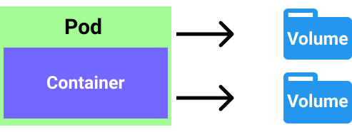

# Storage

To store some data/state/files on the file system for `pods/containers`, the k8s utilize the `volumes` for this. This feature is useful as `pods` have uncertain life expectancy, so if something is important you should no be keeping it on file system of the pod. `Pod` can have multiple `volumes` attached to it. `Container` within the `pod` usee `mountPath` to access the `volume`.

A `volume` represents a reference to the storage location. They must have unique name and they can/don't need to be attached to the lifetime of the `pod`. Volume mount references a defined `volume` and defines a `mountPath` for accessing it. Types of the `volumes`:

1. **emptyDir**: Shares the lifetime of the `pod`. Used to store transient data.
2. **hostPath**: Defines a mount for the `pod` into the `nodes` file system.
3. **nfs**: Network File System that `pod` can use to access the drive on the network.
4. **configMap**: Allows storing of key-value pairs. Used for configurations that can be accessed from within the `container`.
5. **secret**: Same as configMap but intended to store sensitive data (hence the name).
6. **persistentVolumeClaim**: Represents the abstraction of the persistent storage that `pod` can use without knowing exact details of the storage.
7. **cloud**: cluster-wide storage outside of the network.
8. for more types and information: [https://kubernetes.io/docs/concepts/storage/volumes/#types-of-volumes](https://kubernetes.io/docs/concepts/storage/volumes/#types-of-volumes)

<p align=center>
  
</p>

An example on how to declare the `emptyDir volume`:

```yml
apiVersion: v1
kind: Pod
metadata:
  name: my-nginx
  labels:
    name: my-nginx
spec:
  volumes:
    - name: my-volume
      emptyDir: {}
  containers:
  - name: my-nginx
    image: nginx:alpine
    volumeMounts:
      - mountPath: /usr/share/nginx/html
        name: my-volume
        readOnly: true
    resources:
      limits:
        memory: "128Mi"
        cpu: "500m"
    ports:
      - containerPort: 80
```

Now we can describe our `pod` and we should see the information about the volume in there:

```yml
...
Mounts:
      /usr/share/nginx/html from my-volume (ro)
      /var/run/secrets/kubernetes.io/serviceaccount from default-token-kxzww (ro)
...
Volumes:
  my-volume:
    Type:       EmptyDir (a temporary directory that shares a pod's lifetime)
    Medium:
    SizeLimit:  <unset>
```

For more information about `volumes`: [https://kubernetes.io/docs/concepts/storage/volumes/](https://kubernetes.io/docs/concepts/storage/volumes/). This is an extensive topic that is different between the use-cases. This goes for `PersistentVolume` and other types of storage, not just the ones I showed above.
